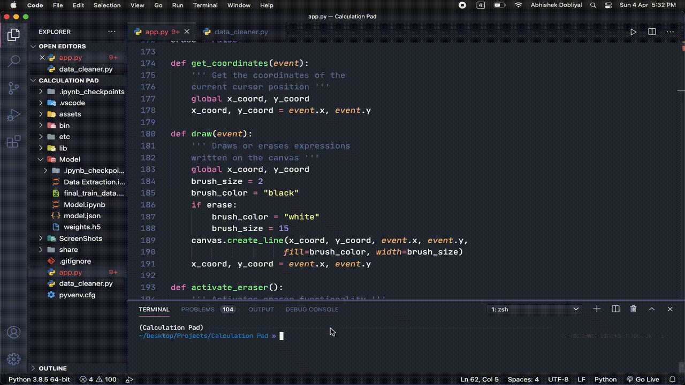

# Calculation-Pad
Jot down any mathematical expression as you would on a paper, Let Machine Learning take care of the rest.



## Installation and Dependencies

1. [Python](https://www.python.org).

2. Get the math symbols dataset from [here](https://www.kaggle.com/xainano/handwrittenmathsymbols) in case you would want to add more functionalities.

3. Get the Wolfram API ID from [here](https://products.wolframalpha.com/api/).

4. Open up Terminal/CMD and type in:

- Windows Users
```bash
pip install -r requirements.txt
```

- MacOS/ Linux Users
```bash
pip3 install -r requirements.txt
```

## Usage

Inside the Repository's directory, Open Terminal/ Command Prompt and type in:

- Windows Users
```bash
python app.py
```

- MacOS/ Linux Users
```bash
python3 app.py
```

## Note

- Kindly do not move, delete, rename or modify any files (unless you know what you are doing).

- The pre-trained model has an accuracy of over **97%**.

- You need to extract data (from the dataset) as well as train your model again if you chose to add more functionality (digits/symbols).
